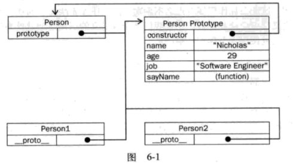
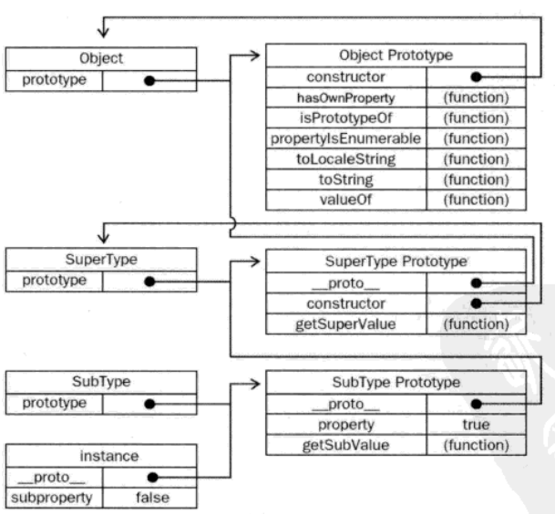

# 面向对象的程序设计

## 理解对象

### 属性类型

#### 1.数据属性

特性：

-   Configurable : 表示能否通过 delete 删除属性，能否修改属性特性，能否把属性改为访问器属性
-   Enumerable ： 表示能否通过 for in 循环返回
-   Writable : 表示能否修改属性的值
-   Value ： 包含属性的值，读取或写入实际上操作的是这个值

#### 2.访问器属性

特性：

-   Configurable : 表示能否通过 delete 删除属性，能否修改属性特性，能否把属性改为访问器属性
-   Enumerable ： 表示能否通过 `for in` 循环返回
-   Get : 读取时调用的参数.默认值为 `undefined`
-   Set ： 写入时调用的参数。 默认值为 `undefined`

#### 3.注意：

-   访问器属性不能直接定义，必须使用 Object.defineProperty()定义。
-   修改属性默认的特性，必须使用 Object.defineProperty()方法
-   get,set,并不一定要定义，只定义 get 为只读，只定义 set 为只写不可读。
-   定义多个属性可以使用 Object.defineProperties()方法
-   读取属性的特性，使用 Object.getOwnPropertyDescriptor()

## 创建对象

### 1.工厂模式

定义一个方法接受参数，用于创建对象，并将其返回

```javascript
function createPerson(name, age) {
    var o = new Object();
    o.name = name;
    o.age = age;
    return o;
}
var person1 = createPerson('andy_chen', 18);
var person2 = createPerson('andy_chen', 18);
```

 <p style="color:red">工厂模式可以创建多个相似对象的问题，却没解决对象识别的问题。例如person1的类型是什么</p>

### 2.构造函数模式 :

```javascript
function Person(name, age) {
    this.name = name;
    this.age = age;
    this.sayName = function() {
        alert(this.name);
    };
}
var person1 = new Person('andy_chen', 18);
var person2 = new Person('andy_chen', 18);
person1.sayName();
person2.sayName();
```

#### 使用 new 操作符。实际上有以下 4 个步骤:

-   创建一个新对象
-   将构造函数的作用域赋给对象（使 this 指向新对象）
-   执行构造方法（为这个对象添加属性）
-   返回新对象

 <p style="color:red">构造函数的问题在于，每个方法都要在每个实例中重新创建一遍。即例子中，person1和person2的sayName的不相等的。但是，完成同样的功能的方法，却每个实例都要创建一遍，这显然不合理，所以，又出现了下面的原型模式</p>

### 3.原型模式：

#### 理解原型对象

一图胜千言：



-   只要创建了一个新函数，就会根据一组特定规则为该函数创建一个 prototype，这个属性指向函数的对象原型。
-   对象原型中，则默认有一个 constructor 属性，指向该新函数。
-   通过新函数创建的实例，有一个[[prototype]]属性（在 chrome，firefox，safari 中该属性即为*proto*），指向了新函数的 prototype。

    > 注意：该属性仅仅是执行构造函数的 prototype，也即是说，他们与构造函数没有直接联系了

-   读取某个对象的属性时，会先在实例上找，如果没找到，则进一步在实例上的 prototype 属性上找
-   为实例添加属性的时候会屏蔽掉原型上属性。这个时候即使置为 null 也没法访问到原型上的属性，只有通过 delete 删掉之后才可以
-   XXX.prototype.isPrototype(xxx), 可以用这个方法判定对象是否是该实例的原型对象
-   Object.getPrototypeOf() 用这个可以获取实例对应的原型对象 （ES5 新增方法）

#### in 操作符

-   单独使用时： in 操作符 可以确定属性是否存在于对象上（无论是存在于实例上还是原型上）
-   用于 for 循环中时，返回的是所有能够通过对象访问的，可枚举的属性。（IE8 中，如果开发者自定义 toString 类似的系统不可枚举的方法，浏览器还是不会将它遍历出来）

> ES5：Object.keys() 可以返回一个包含所有可枚举属性的字符串数组
> Object.getOwnPropertyNames() 可以返回所有实例属性，无论是否可枚举

```javascript
//原型模式的实现：
function Person() {}

Person.prototype.name = 'andy chen';

Person.prototype.sayName = function() {
    alert(this.name);
};
```

#### 更简单的原型语法

重写整个 prototype,不过会导致 constructor 改变。所以需要重新指定 constructor.

```javascript
//更简单的原型语法
function Person() {}
Person.prototype = {
    constructor: Person, //因为这种写法会覆盖掉原来的Person.prototype,需要重新为constructor赋值
    name: 'andy chen',
    sayName: function() {
        alert(this.name);
    }
};
var person1 = new Person();
var person2 = new Person();
```

 <p style="color:red">原型模式的问题：所有实例都共享一个prototype，类似上面的例子，person1,person2的name属性是共享的。如果修改其中一个，会导致另一个也受影响。所以，才会出现下面构造函数与原型模式组合使用</p>

### 4.组合使用构造函数和原型模式

**创建自定义类型最常见的方式就是组合使用构造函数和原型模式**

构造函数定义实例属性，而原型模式用于定义方法和共享的属性. 所以，上面的例子可以改写成这样：

```javascript
function Person(name) {
    this.name = name;
}
Person.prototype = {
    constructor: Person,
    sayName: function() {
        alert(this.name);
    }
};
var person1 = new Person('andy chen');
var person2 = new Person('andy chen');
```

除了使用组合模式创建对象，还有以下几种方式，可以针对不同的情况选择。

### 5.动态原型模式

在构造方法中，判断是否是第一次进入使用构造方法，如果是，则添加一系列的方法到原型上

### 6.寄生构造函数模式

类基本思想是创建一个函数，该函数的作用仅仅是封装创建对象的代码然后再返回新创建的对象。
（并没搞懂这种模式究竟有什么用）

### 7.稳妥构造函数模式：

#### 稳妥对象

指的是没有公共属性，而且其方法也不引用 this 对象。最适合用于一些安全的环境或者在防止数据被其他程序改动时使用

#### 稳妥构造函数

遵循与寄生构造函数类似的模式，但有两点不同：

-   新创建的对象实例不引用 this.
-   不使用 new 操作符调用构造函数

## 继承

OO 语言一般拥有两种继承方式：接口继承（只继承方法签名）以及实现继承（继承实际方法）
ES 无法像其他 OO 语言一样支持接口继承，只能依靠原型链实现 实现继承

### 1. 原型链

#### 要了解原型链的概念，先回顾一下构造函数，原型和实例之间的关系（参考图 6-1）

-   每个构造函数都有一个原型对象，原型对象包含一个指向构造函数的指针.
-   每个实例都包含一个指向原型对象的内部指针的内部属性（在 chrome 中一般为**proto**属性）

那么，如果我们有个新的构造函数，并让它的原型对象等于另一个类型的实例，结果会怎样.

对于这个新的构造函数，它的原型对象就变成了另一个类型的实例，而这个实例中，又包含一个内部属性，指向了另一个原型对象（该原型对象内部 constructor 指向另一个构造函数），如果这个原型对象又是另一个类型的实例，则它又包含了一个内部属性，继续指向上层的原型对象。这样层层递进，就形成了原型链。
  
如下图：



#### 特点

-   在实例中搜索属性的时候，便是基于原型链来搜索的，先搜索实例，再在原型链上一层层往上搜，直到找到或者到原型链末端才会停下来
-   由于所有引用类型都继承了 Object，所以原型链的最顶层是 Object
-   使用原型链实现继承时，不能使用对象字面量创建原型方法，因为这样会重写原型链

#### 原型链实现继承的方式：

```javascript
function Animal() {
    this.name = 'animal';
}
Animal.prototype.getName = function() {
    return this.name;
};
function Cat() {
    this.catName = 'cat';
}

Cat.prototype = new Animal();

var cat1 = new Cat();
var cat2 = new Cat();
alert(cat1.getName()); //由于第10行，将Cat的原型指向Animal的实例，因为实例中有指向Animal.prototype的指针。所以，这里可以访问到getName()

cat1.name = 'changed name';
alert(cat2.getName());
```

#### 原型链的问题：

-   使用原型链，由于是使用新的实例作为子类型的原型，实例中却包含了父类型的属性，所以原来父类型的属性，就都到了子类型的原型上了。这就会造成子类型的不同实例会共享同个属性.如上例子中，第 15 行，改 cat1 实例的 name 属性影响到了 cat2 的 name 属性
-   创建子类型的时候，不能向父类型传递参数

### 2. 借用构造函数

由于原型链存在问题，所以便出现了借用构造函数的方法
在子类型的构造方法中，调用父类型的构造方法:SuperType.call(this); 将父类型的属性添加到子类型上，并且可以传递参数给父类型

#### 借用构造函数实现继承的方式：

```javascript
function Animal() {
    this.name = 'animal';
}
function Cat() {
    Animal.call(this);
}
var cat1 = new Cat();
var cat2 = new Cat();
cat1.name = 'changed name';
alert(cat1.name); //changed name
alert(cat2.name); //animal //借用构造函数的方式，各实例之间的属性便不会互相影响
```

#### 借用构造函数问题：

类似创建对象单纯使用构造方法一样，也会造成公有的方法无法公用。所以一般也很少单独使用此方式

### 3. 组合继承

组合原型链以及借用构造函数

-   使用原型链实现对原型属性和方法的继承
-   借用构造函数来实现对实例中属性的继承。

```javascript
function Animal() {
    this.name = 'animal';
}
Animal.prototype.getName = function() {
    return this.name;
};

function Cat() {
    Animal.call(this); //借用构造函数
}
Cat.prototype = new Animal(); //原型链方式
Cat.prototype.constructor = Cat;

//这里可以
var cat1 = new Cat();
var cat2 = new Cat();
cat1.name = 'changed name';

alert(cat1.getName()); //changed name
alert(cat2.getName()); //animal
```

#### 组合继承的问题：

父类的属性会存在于子类型的原型上，导致被不同实例共享。虽然由于借用构造函数之后，导致实例上又重写了这些属性，所以每个实例有各自的属性。

> 另外，instanceof 和 isPrototypeOf 能够识别基于组合继承创建的对象

**组合继承，并不完美
因为我们只需要继承父类型原型上的属性而已，不需要父类型实例的属性。
还有更好的方法，但我们首先要先了解一下其他继承方式**

### 4. 原型式继承

```javascript
//如果o为某个对象的prototype，则object返回的 对象，包含了该对象原型上的所有方法
function object(o) {
    function F() {}
    F.prototype = o;
    return new F();
}
```

Es5 新增的 Object.create() ，类似这样。 在没有必要创建构造函数，只想让一个对象与另一个对象保持类似的情况下，原型式继承是完全可以胜任的。不过，包含引用类型值的属性始终会共享

### 5. 寄生式继承

在复制新对象后，继续以某种方式增强对象，即为寄生式继承。

```javascript
function createAnother(original) {
    var clone = object(original);
    clone.sayHi = function() {
        doSomeThing();
    };
    return clone;
}
```

在主要考虑对象而不是自定义类型和构造函数的时候，适合使用寄生式继承

**缺点**： 类似单纯的构造函数模式使用，函数不能复用

### 6. 寄生组合式继承

通过原型式继承，继承父类的原型方法。再通过构造函数方法，继承父类的属性。

```javascript
function Animal() {
    this.name = 'animal';
}
Animal.prototype.getName = function() {
    return this.name;
};

function Cat() {
    Animal.call(this); //借用构造函数
}

//原型继承方式
function object(superProto) {
    function F() {}
    F.prototype = superProto;
    return new F();
}

Cat.prototype = object(Animal.prototype); //通过一个空的函数作为媒介，将空函数的原型指向父类型原型，并将子类型的原型指向这个空函数的实例。便只继承父类原型上的属性及方法
Cat.prototype.constructor = Cat;
//这里可以之后添加子类的方法
Cat.prototype.run = function() {
    alert('cat run');
};

var cat1 = new Cat();
var cat2 = new Cat();
cat1.name = 'changed name';
alert(cat1.getName()); //changed name
alert(cat2.getName()); //animal
```

最后，寄生组合式继承是引用类型最理想的继承范式。
上述代码还能再进一步优化。

```javascript
//原型继承方式
function object(superProto) {
    function F() {}
    F.prototype = superProto;
    return new F();
}
//公用的继承方法
function inheritPrototype(subType, superType) {
    subType.prototype = object(superType.prototype);
    subType.prototype.constructor = subType;
}

function Animal() {
    this.name = 'animal';
}
Animal.prototype.getName = function() {
    return this.name;
};
function Cat() {
    Animal.call(this); //借用构造函数
}

inheritPrototype(Cat, Animal); //调用此方法继承原型

//这里可以之后添加子类的方法
Cat.prototype.run = function() {
    alert('cat run');
};
var cat1 = new Cat();
var cat2 = new Cat();
cat1.name = 'changed name';
alert(cat1.getName()); //changed name
alert(cat2.getName()); //animal
```

## 小结

这是 js 对象的创建以及继承，es6 中新增了关键字`class`和`extend`。方便我们进行面向对象的编程。

但是理解背后的继承原理对我们编程过程中也是极有帮助的

：）
