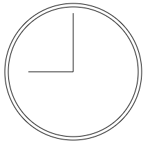
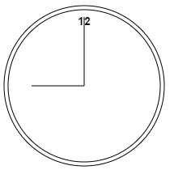
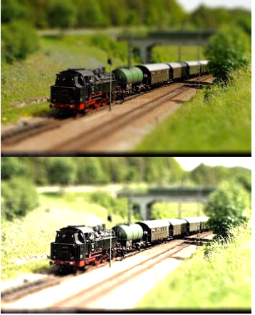

# 使用 canvas 绘图

HTML5 添加的最受欢迎的功能就是`<canvas>`元素，这个元素负责在页面中设定一个区域，然后就可以通过 javascript 动态的在这个区域中绘制图形

## 基本用法

1. 使用 canvas 元素，必须指定 width，height 属性
2. 开始标签和结束标签之间的内容，是后备信息。如果浏览器不支持 canvas，则显示该信息
   `<canvas id="drawing" width="200" height="200"> drawing something </canvas>`
3. 要在画布（canvas）上绘图，需获取 2D 上下文。

```javascript
    var drawing = document.getElementById("drawing");
    if(drawing.getContext){ //必须先判断，因为有些浏览器并没有getContext方法
      var context = drawing.getContext("2d");
      //更多操作
    }
```

## 2D 上下文

### 原点坐标

坐标原点位于 canvas 的左上角，原点为（0,0），越往右 x 值越大，越往下 y 值越大

### 填充和描边

2D 上下文绘图操作基本是两种：

1. 填充：用指定样式填充图形，操作结果取决于 fillStyle
2. 描边：只在图形边缘划线 ，操作结果取决于 strokeStyle
    > 将 `context.fillStyle` 或 `context.strokeStyle` 设为某个值后，之后所有的描边和填充操作都会使用对应的值，直到重新设置这两个值

如何使用将与下面绘制矩形一同介绍

### 绘制矩形

矩形是唯一一种可以在 2D 上下文中绘制的形状，包含三个方法：`fillRect()` 、 `strokeRect()` 、 `clearRect()`
接受参数都一样是 4 个参数，分别是：x 坐标，y 坐标，宽度，高度
下面是使用的例子：

```javascript
var drawing = document.getElementById("drawing");
if (drawing.getContext) {
    var context = drawing.getContext("2d");
    context.strokeStyle = "#ff0000";
    context.strokeRect(10, 10, 50, 50); //绘制空心矩形（描边）
    context.fillStyle = "#0000ff";
    context.fillRect(70, 10, 50, 50);//绘制实心矩形（填充）
    context.clearRect(80, 20, 20, 20);//清空某个区域
}
```

执行结果：

第二个矩形中间的空白部分就是被清空了的

### 绘制路径

2D 上下文支持很多在画布上绘制路径的方法，通过路径可以创造出复杂的图形
绘制路径的操作流程为：

1. 必须调用 `beginPath()`, 表示开始绘制新路径
2. 调用绘制路径的方法。
3. 如果想绘制一条连接到路径起点的线条，调用 `closePath()`
4. 对路径进行填充 `fill()` 或 描边 `stroke()` 、或者创建一个剪切区域 `clip()`

#### 接下来让我们来绘制一个钟表

首先了解下待会会使用到的绘制路径的方法：

-   `arc(x , y , radius , startAngle , endAngle , counterclockwise)`: 以圆心绘制一条弧线，半径为 radius，起始角度和结束角度
-   `lineTo(x,y)`从上一点（也就是游标当前点）开始绘制一条直线，到 ( x,y ) 为止
-   `moveTo(x,y)`将游标移动到 ( x , y ), 不画线
    除了这些之外，绘制路径还有其他一些方法：
-   `arcTo , bezierCurveTo , quadraticCurveTo ,rect`,这些就请自行参与官方文档了

```javascript
    var drawing = document.getElementById("drawing");
    if (drawing.getContext) {
        var context = drawing.getContext("2d");
        //1.开始路径
        context.beginPath();
        //2.开始绘制路径
        //绘制外圆
        context.arc(100, 100, 99, 0, 2 * Math.PI, false);
        //绘制内圆
        context.moveTo(194, 100);//先把游标移动到要内圆起点
        context.arc(100, 100, 94, 0, 2 * Math.PI, false);
        //绘制分针
        context.moveTo(100, 100);
        context.lineTo(100, 15);
        //绘制时针
        context.moveTo(100, 100);
        context.lineTo(35, 100);
        //3.绘制路径完，进行描边
        context.stroke();
    }
```

执行结果：


> 注意：arc()中的参数度数是弧度而不是角度，1 弧度 = 180° / π，1° = π /180 ，所以，旋转 360°，需要旋转 2π 弧度

### 绘制文本

2D 绘图上下文也提供了绘制文本的方法： `fillText()` 和 `strokeText()`
都有 4 个参数：要绘制的文本字符串，x 坐标 ,y 坐标，最大像素宽度（可选）
在使用绘制文本方法之前，应该先设置下列 3 个属性：`font，textAlign，textBaseLine`
让我们为上一个例子的钟表添加一个 12 的数字

```javascript
context.font = "bold 14px Arial";
context.textAlign = "center";
context.textBaseline = "middle";
context.fillText("12", 100, 20);
```

运行结果：


### 变换

通过上下文的变换，可以把处理后的图像绘制到画布上。
可通过如下方法来修改变换矩阵：
`rotate(angle)`:围绕原点旋转图像 angle 弧度。
`scale（scaleX，scaleY）`：缩放图像
`translate(x,y)`将坐标原点移到 x , y
`transform(m1_1,m1_2,m2_1,m2_2,dx,dy)`:直接修改变换矩阵
变换可能很简单。对于绘制表针来说，如果把原点变换到表盘中心，在绘制表针，就容易得多

```javascript
var drawing = document.getElementById("drawing");
    if (drawing.getContext) {
        var context = drawing.getContext("2d");
        //1.开始路径
        context.beginPath();
        //2.开始绘制路径
        //绘制外圆
        context.arc(100, 100, 99, 0, 2 * Math.PI, false);
        //绘制内圆
        context.moveTo(194, 100);//先把游标移动到要内圆起点
        context.arc(100, 100, 94, 0, 2 * Math.PI, false);
		context.translate(100, 100);//主要是这里将坐标原点移到(0,0)，所以接下来的计算都相对于圆心来计算
        //绘制分针
        context.moveTo(0, 0);
        context.lineTo(0, -85);
        //绘制时针
        context.moveTo(0, 0);
        context.lineTo(-65, 0);
        //3.绘制路径完，进行描边
        context.stroke();
    }
```

结果与上面一模一样，但是计算就要简单得多。
对于上下文的属性与变换，可以使用`save()`来保存，当时的设置会被保存进一个栈结构。
当想使用之前保存的设置，则调用`restore()`方法

### 绘制图像

2D 上下文内置了对图像的支持。

-   drawImage()

```javascript
context.drawImage(img, 0, 0, 200, 200, 0, 0, 300, 300);//参数分别是 ： 要绘制的图像、原图像的x、y、宽度、高度、目标图像的x、y、宽度、高度
```

> 注意：图像需要预加载，或者在 img.onload 中执行 drawImage 才有效

-   toDataURL()

```javascript
var drawing = document.getElementById("drawing");
if (drawing.getContext) {
    var context = drawing.getContext("2d");
}
var src = drawing.toDataURL();//获得canvas中的图像数据
var canvasImg = new Image();
canvasImg.src = src;
document.body.appendChild(canvasImg);
```

### 使用图像数据

2D 上下文有个长处，可以通过 getImageData()取得原始图像数据.
这个方法非常有用。

```javascript
var imageData = context.getImageData(10,5,50,50);//(10,5)左上角，大小为50*50的区域的图像数据
```

让我做一个灰阶过滤器：

```javascript
var drawing = document.getElementById("drawing");
if (drawing.getContext) {
    var context = drawing.getContext("2d");
	var img = document.images[0];
	context.drawImage(img, 0, 0);
	var imageData = context.getImageData(0, 0, img.width, img.height);
	var data = imageData.data;
	var red, green, blue, alpha, average;
	//对图像数据的red green blue 进行处理
	for (var i = 0, len = data.length; i < len; i += 4) {
	    red = data[i];
	    green = data[i + 1];
	    blue = data[i + 2];
	    alpha = data[i + 3];
	    average = Math.floor((red + green + blue) / 3);
	    data[i] = red + 100;
	    data[i + 1] = green + 100;
	    data[i + 2] = blue + 100;
	}
	imageData.data = data;
	context.putImageData(imageData, 0, img.height);
}

```

结果：分别是处理前和处理后。


图像数据除了做灰阶过滤器，还有很多其他功能，例如 锐化、亮度之类的，有兴趣的可以到这里了解下：
http://www.html5rocks.com/en/tutorials/canvas/imagefilters/ ，请自备梯子

### 其他：

2d 上下文还有其他的以下功能： 阴影、渐变、 模式、 合成，这些就不细讲了！

: )
