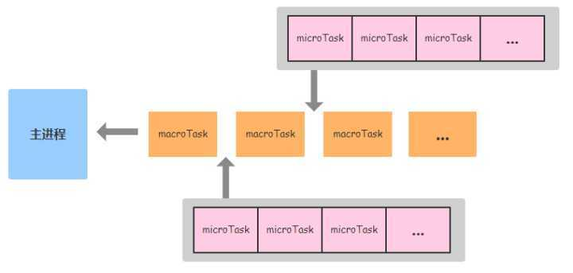

# js 任务

## 前言

先看一段代码

```javascript
setTimeout(function() {
    console.log('timeout');
}, 0);

new Promise((resolve, reject) => {
    console.log('promise');
    resolve();
}).then(function() {
    console.log('then');
});

console.log('global');
```

输出： `promise 、global、 then、timeout`

## macrotasks 和 microtasks

在 V8 实现中包含两种任务：

#### macrotasks

`script` ,`setTimeout`, `setInterval`, `setImmediate`, `I/O`, `UI rendering`

#### microtasks

`process.nextTick`, `Promises`, `Object.observe`, `MutationObserver`

#### 执行过程如下：



1. JavaScript 引擎首先从 macrotask queue 中取出**第一个任务**，
2. 执行完毕后，将**microtask queue**中的**所有任务**取出，按顺序**全部执行**；
3. 浏览器进行渲染视图然后再从 macrotask queue 中取**下一个**，
4. 执行完毕后，再次将 microtask queue 中的全部取出；
5. 循环往复，直到两个 queue 中的任务都取完。

::: tip 注意：

-   从上面可以看到，microtask 会执行完毕才进行渲染，如果 microtask 执行时间教长，会导致卡顿
-   上面执行过程只是 chrome 的，safri 又不太一样

:::

执行过程的示例 ：
https://jakearchibald.com/2015/tasks-microtasks-queues-and-schedules/?utm_source=html5weekly

## 如何模拟 Promise.then

```js
new MutationObserver(function() {
    console.log('mutate');
}).observe(document.body, {
    attributes: true
});
document.body.setAttribute('data-random', Math.random());

setTimeout(function() {
    console.log('timeout');
}, 0);
new Promise((resolve, reject) => {
    console.log('promise');
    resolve();
}).then(function() {
    console.log('then');
});
console.log('global');
```

输出： promise 、global、mutate、 then、timeout

#### 参考文章：

-   `microTask`: https://github.com/kaerus-component/microTask/blob/master/index.js
-   `es-promise` : https://github.com/stefanpenner/es6-promise/blob/master/lib/es6-promise/asap.js
